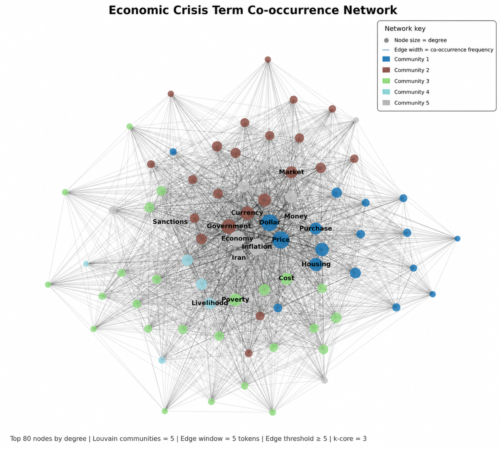
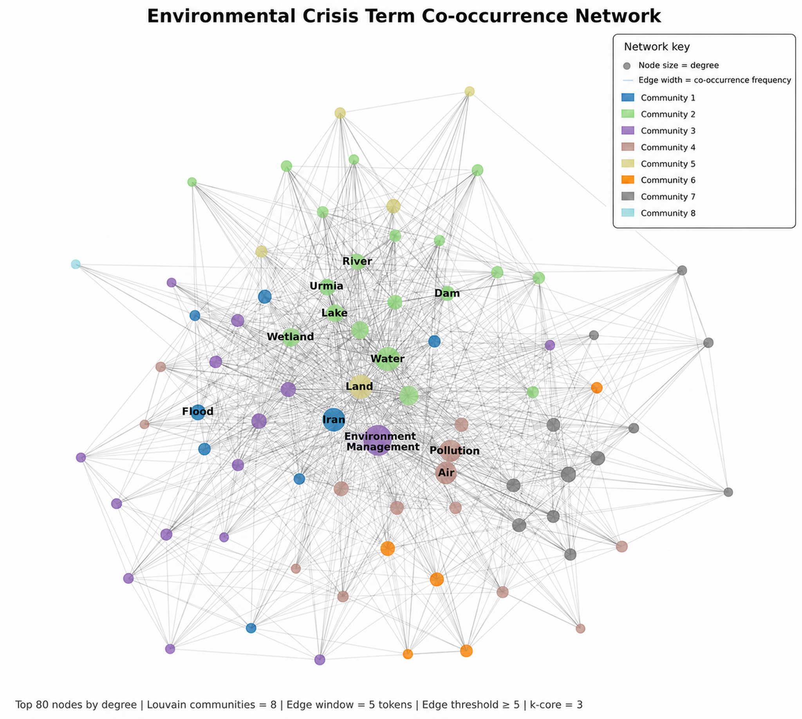

# 🧠 Persian Social Media Topic Modeling & Semantic Network Analysis

<p align="center">
  <b>A Comparative NLP Framework for Persian Social Media Analysis</b>
</p>

<p align="center">
  LDA • TF-IDF • Word2Vec • BERT • Network Analysis • Temporal Modeling • Statistical Evaluation
</p>

---

## 🚀 Project Overview

This project presents an **end-to-end Natural Language Processing (NLP) framework for analyzing Persian social media discourse** using multiple topic-modeling and semantic-analysis techniques.

Instead of relying on a single algorithm, the project combines classical statistical approaches, semantic embeddings, transformer-based representations, temporal analysis, network analysis, and statistical model comparison.

The implemented approaches include:

* 🧩 **Latent Dirichlet Allocation (LDA)**
* 📊 **TF-IDF-based Topic Modeling**
* 🔗 **N-gram Analysis**
* 🧠 **Word2Vec Semantic Representations**
* 🤖 **BERT-based Semantic Embeddings**
* 🕸️ **Semantic Network Analysis**
* ⏳ **Temporal Topic Analysis**
* 📈 **Friedman & Nemenyi Statistical Comparison**

---

## 🎯 Research Motivation

Persian social media data presents several challenges for conventional NLP methods, including informal language, morphological variation, sparse lexical representations, and context-dependent meaning.

Traditional bag-of-words approaches are useful for identifying lexical patterns but may fail to capture deeper semantic relationships.

This project therefore investigates **lexical, probabilistic, embedding-based, transformer-based, structural, and temporal representations** within a unified analytical workflow.

> **Research Question:**
> How effectively can different NLP representations uncover meaningful thematic, semantic, and structural patterns in Persian social media discourse?

---

## 🧬 Analysis Pipeline

```text
Persian Social Media Data
          │
          ▼
┌──────────────────────┐
│   Text Preprocessing │
└──────────┬───────────┘
           │
           ▼
┌─────────────────────────────────────────┐
│        Topic Representation             │
│                                         │
│   LDA  •  TF-IDF  •  N-grams           │
└──────────────────┬──────────────────────┘
                   │
                   ▼
┌─────────────────────────────────────────┐
│        Semantic Representation          │
│                                         │
│       Word2Vec  •  BERT                 │
└──────────────────┬──────────────────────┘
                   │
          ┌────────┴────────┐
          ▼                 ▼
   Topic Discovery    Network Analysis
          │                 │
          └────────┬────────┘
                   ▼
            Temporal Analysis
                   │
                   ▼
        Statistical Comparison
                   │
                   ▼
          Friedman + Nemenyi
```

---

# 🔬 Methods

## 1️⃣ Latent Dirichlet Allocation — LDA

LDA is used as a probabilistic topic-modeling approach for discovering latent thematic structures from word co-occurrence patterns.

It provides interpretable topic-word distributions and serves as an important baseline for comparison with more advanced semantic approaches.

📓 **Notebook:** `Topic_Modeling_LDA.ipynb`

---

## 2️⃣ TF-IDF Topic Representation

TF-IDF weighting emphasizes discriminative terms while reducing the influence of extremely common words.

This provides a lexical representation for identifying topic-specific vocabulary within Persian social media content.

📓 **Notebook:** `Topic_Modeling_TF_IDF.ipynb`

---

## 3️⃣ N-gram Analysis

N-gram analysis captures recurring multi-word expressions that may not be detected when words are analyzed independently.

This approach helps identify common phrases, recurring expressions, and meaningful lexical combinations.

📓 **Notebook:** `Topic_Modeling_N_gram.ipynb`

---

## 4️⃣ Word2Vec Semantic Modeling

Word2Vec embeddings represent words in a continuous vector space, allowing semantically related concepts to be identified beyond direct lexical overlap.

This provides an additional semantic layer beyond traditional frequency-based representations.

📓 **Notebook:** `Topic_Modeling_Word2vec.ipynb`

---

## 5️⃣ BERT-Based Semantic Modeling

Transformer-based contextual embeddings are used to represent text according to semantic meaning rather than word frequency alone.

BERT-based representations enable richer modeling of contextual relationships within Persian social media content.

📓 **Notebook:** `Topic_Modeling_Bert.ipynb`

---

# 🕸️ Semantic Network Analysis

Topic modeling is complemented by **graph-based analysis** to examine relationships among concepts.

Within the network representation, concepts can be modeled as nodes and their relationships as edges.

This makes it possible to investigate:

* Semantic communities
* Highly connected concepts
* Community structures
* Relationships among recurring themes
* Differences in discourse organization

📓 **Notebook:** `Topic_Modeling_Graph.ipynb`

---

# 🖼️ Visual Results

## 🌐 Economic & Environmental Semantic Networks

To investigate how concepts are structurally organized within Persian social media discourse, semantic networks were constructed separately for **economic** and **environmental** discussions.

These visualizations complement topic modeling by showing how concepts are interconnected and organized into larger semantic structures.

---

### 💰 Economic Discourse Network

<p align="center">
  
</p>

<p align="center">
  <i>Semantic network of economic discourse showing relationships and community structures among interconnected economic concepts.</i>
</p>

---

### 🌱 Environmental Discourse Network

<p align="center">
  
</p>

<p align="center">
  <i>Semantic network of environmental discourse showing relationships and community structures among interconnected environmental concepts.</i>
</p>

---

## 🔍 Economic vs. Environmental Discourse

The semantic networks provide a structural perspective for comparing economic and environmental conversations.

| 💰 Economic Discourse                        | 🌱 Environmental Discourse                             |
| :------------------------------------------- | :----------------------------------------------------- |
| More continuous discussion patterns          | More episodic discussion patterns                      |
| Dense relationships among recurring concepts | More fragmented thematic structures                    |
| Persistent thematic connections              | Greater concentration around specific events or issues |

Together, the networks illustrate differences in the structural organization of economic and environmental discourse.

> 📁 High-resolution versions of both visualizations are available in the [`figures/`](figures/) directory.

---

# ⏳ Temporal Topic Analysis

Social media conversations evolve over time.

The temporal component of this project examines how thematic structures change across different periods and enables the exploration of:

* Emerging topics
* Declining themes
* Persistent discussions
* Temporal fluctuations
* Changes in discourse structure

📓 **Notebook:** `Topic_Modeling_by_Time.ipynb`

---

# 📊 Statistical Model Comparison

Producing several topic models does not by itself establish whether their performance differs systematically.

For this reason, the project includes statistical comparison using the **Friedman test** and **Nemenyi post-hoc analysis**.

### Friedman Test

The Friedman test evaluates whether statistically significant differences exist among the modeling approaches being compared.

### Nemenyi Post-hoc Test

When differences are detected, the Nemenyi procedure enables pairwise comparison among methods.

📓 **Notebook:** `Friedman_Nemenyi.ipynb`

This adds a statistical evaluation layer to the modeling pipeline rather than relying solely on qualitative or visual comparison.

---

# 🧠 Why Multiple Models?

Different NLP techniques capture different dimensions of language.

| Method                | Primary Role                            |
| --------------------- | --------------------------------------- |
| **LDA**               | Probabilistic topic discovery           |
| **TF-IDF**            | Discriminative lexical representation   |
| **N-grams**           | Multi-word pattern discovery            |
| **Word2Vec**          | Semantic word representation            |
| **BERT**              | Context-aware semantic representation   |
| **Network Analysis**  | Structural relationships among concepts |
| **Temporal Analysis** | Evolution of discourse over time        |
| **Friedman/Nemenyi**  | Statistical comparison                  |

The goal is therefore not simply to apply one topic-modeling algorithm, but to investigate Persian social media discourse from several complementary analytical perspectives.

---

# 📁 Repository Structure

```text
Topic_Modeling/
│
├── README.md
│
├── Topic_Modeling_Bert.ipynb
├── Topic_Modeling_Graph.ipynb
├── Topic_Modeling_LDA.ipynb
├── Topic_Modeling_N_gram.ipynb
├── Topic_Modeling_TF_IDF.ipynb
├── Topic_Modeling_Word2vec.ipynb
├── Topic_Modeling_by_Time.ipynb
├── Friedman_Nemenyi.ipynb
│
└── figures/
    ├── economic_semantic_network.png
    └── environmental_semantic_network.png
```

---

# 🛠️ Technology Stack

### 💻 Programming

`Python` · `Jupyter Notebook`

### 🧠 NLP & Machine Learning

`BERT` · `Transformers` · `Gensim` · `Scikit-learn` · `Word2Vec`

### 📊 Data Processing

`Pandas` · `NumPy`

### 🕸️ Network Analysis

`NetworkX`

### 📈 Visualization

`Matplotlib` · `WordCloud`

### 📐 Statistical Analysis

`SciPy` · `Friedman Test` · `Nemenyi Post-hoc Analysis`

---

# ⚙️ Getting Started

Clone the repository:

```bash
git clone https://github.com/MonaFaghfouri/Topic_Modeling.git
```

Move into the project directory:

```bash
cd Topic_Modeling
```

Launch Jupyter Notebook:

```bash
jupyter notebook
```

Then open the notebook corresponding to the analysis you want to explore.

---

# 🔁 Reproducibility

Each analytical approach is provided in a separate Jupyter Notebook so that the methods can be inspected and executed independently.

A typical workflow consists of:

1. Preparing and preprocessing the Persian text data.
2. Selecting the desired representation or modeling approach.
3. Executing the corresponding notebook.
4. Inspecting topic or semantic outputs.
5. Exploring structural and temporal patterns.
6. Comparing modeling approaches statistically.

> **Data Availability:** The original research dataset is not included in this public repository. The notebooks demonstrate the analytical methodology and implementation.

---

# 🌍 Applications

The framework can be adapted for several NLP and computational social science applications:

* Social media discourse analysis
* Persian NLP
* Public opinion analysis
* Environmental discourse analysis
* Economic discourse analysis
* Crisis and risk communication
* Trend detection
* Semantic network analysis
* Computational social science

---

# ✨ Key Contribution

The key contribution of this project is the integration of multiple analytical perspectives within a single Persian social media NLP workflow:

<p align="center">
  <b>Lexical → Probabilistic → Semantic → Structural → Temporal → Statistical</b>
</p>

By combining traditional topic modeling with embedding-based representations, transformer models, semantic networks, temporal analysis, and statistical evaluation, the project provides a broader framework for investigating complex Persian-language social media discourse.

---

# 🚧 Future Development

Potential extensions include:

* BERTopic
* Sentence Transformer embeddings
* Dynamic topic modeling
* Automated hyperparameter optimization
* Interactive topic visualization
* LLM-assisted topic interpretation
* Cross-lingual discourse comparison
* Automated NLP pipelines

---

# 👩‍💻 Author

## Mona Faghfouri Azar

**Data Analyst | NLP & AI Researcher**

Research interests:

`Natural Language Processing` • `Artificial Intelligence` • `Computational Social Science` • `Social Media Analytics` • `Network Analysis`

GitHub: [MonaFaghfouri](https://github.com/MonaFaghfouri)

---

## ⭐ Support

If you find this project useful or interesting, consider giving the repository a **⭐ Star**.

<p align="center">
  <b>Built for NLP, AI & Computational Social Science Research</b>
</p>
